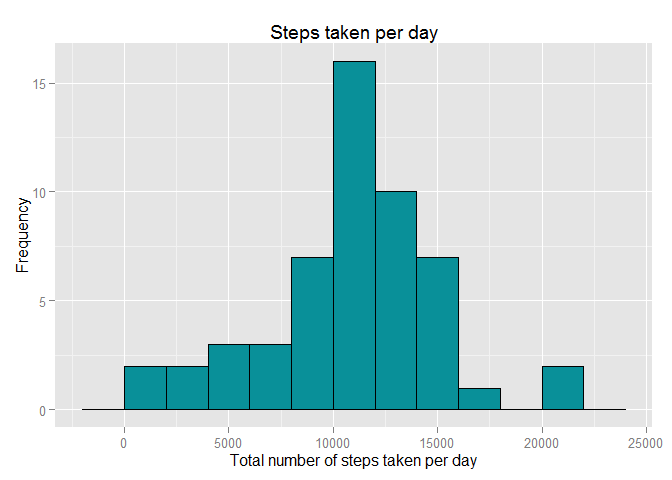
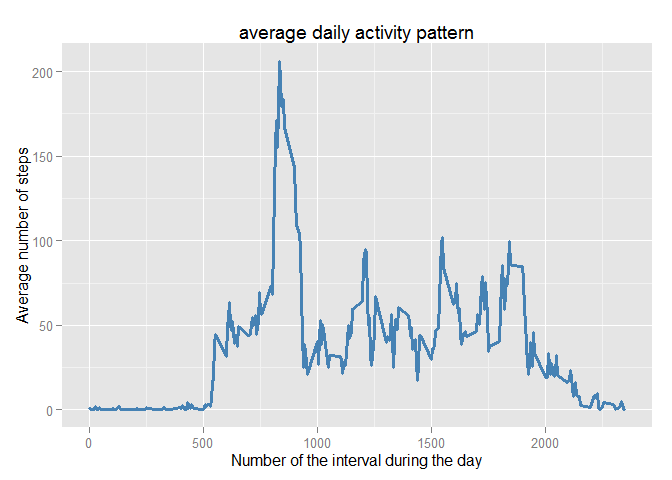
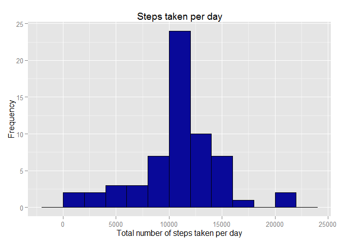
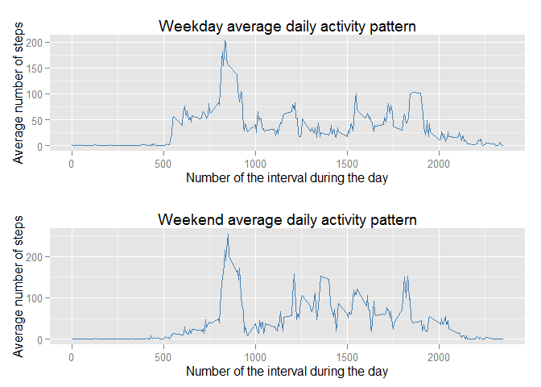

# Reproducible Research: Peer Assessment 1
Check and set global options to make sure that echoing is enabled

```{r setoptions, echo =TRUE, results='markup'}```

## Loading and preprocessing the data


Firstly, there iz a zip archive which contains file 'activity.csv'.
It needs to be unpacked and readed into a data frame (for that small 
volume of data, data frame is the most suitable)

```r
activity_data <- read.table(unz("activity.zip", "activity.csv"), 
                            sep = ",", 
                            header = TRUE,
                            stringsAsFactors = FALSE)
```

## What is mean total number of steps taken per day?

To get mean of steps taken per day, calculate mean using by function. 
After that it is necessary to convert in to a data.frame that will allow 
to print table data using kable. 


```r
dailytotal <- by(activity_data$steps, activity_data$date, sum)
df_bydate <- data.frame(cbind(dailytotal))
df_bydate <- cbind(date = as.Date(rownames(df_bydate)), df_bydate) 
row.names(df_bydate) <- NULL

library(ggplot2)

ggplot(aes(x = df_bydate$dailytotal), data = df_bydate) +
        geom_histogram(color = 'black', 
                      fill = I('#099099'),
                       binwidth = 2000) +        
        xlab('Total number of steps taken per day') +
        ylab('Frequency') + 
        labs(title="Steps taken per day")
```

 

### Now it is easier to get mean and median of steps taken per day. 


```r
meansteps <- round(mean(df_bydate$dailytotal,na.rm = TRUE),2)
mediansteps <- round(median(df_bydate$dailytotal,na.rm = TRUE),2)
```
The mean of steps maiden per day is 1.076619\times 10^{4} and the median value is
almost the same - 1.0765\times 10^{4}.

## What is the average daily activity pattern?

Firstly we need to transform initial data using by to get average values for 
each interval over all days.


```r
a_data <- subset(activity_data,!is.na(steps))
byinterval <- by(a_data$steps,
                        a_data$interval, 
                        mean)
df_byinterval <- data.frame(cbind(byinterval))
df_byinterval <- cbind(interval = as.integer(rownames(df_byinterval)), 
                       df_byinterval) 
row.names(df_byinterval) <- NULL
```

After data transformation, it is time to use resulting data frame to make time series plot


```r
ggplot(df_byinterval, aes(x = interval, y = byinterval)) +
   geom_line(lwd = 1.3, colour = "steelblue") +        
        xlab('Number of the interval during the day') +
        ylab('Average number of steps') + 
        labs(title="average daily activity pattern")
```

 

To find an interval containing maximum value of steps it is better to use 
which.max function. 


```r
maxinterval <- df_byinterval[which.max( df_byinterval[,"byinterval"] ),"interval"]
```
The interval containing maximum steps, on average across all days is 835.

## Imputing missing values

To evaluate the influence of missing values need to find their total number 
in the initial dataset


```r
rowswnas <- nrow(subset(activity_data,is.na(steps)))
percentwnas <- round(rowswnas/nrow(activity_data) * 100,2)
```
It is easy to see that dataset has 2304 rows with missing values that is about 13.11 percent of all data. 

To change missing values with somewhat more appropriate it seems rationally to use a mean for 5-minute interval. Moreover, previous table of average activity by interval will help. 


```r
a_data2 <- activity_data
for(i in 1:nrow(a_data2)){
  if(is.na(a_data2[i,"steps"])) {
          a_data2[i,"steps"] <- df_byinterval[which(df_byinterval$interval == a_data2[i,"interval"]),"byinterval"]
        }          
}

rowswnas2 <- nrow(subset(a_data2,is.na(steps)))
```
Now we have 0 rows with NA values in new dataset. Let's do the same
calculations and plotting like in step 2. 


```r
dailytotal <- by(a_data2$steps, a_data2$date, sum)
df_bydate <- data.frame(cbind(dailytotal))
df_bydate <- cbind(date = as.Date(rownames(df_bydate)), df_bydate) 
row.names(df_bydate) <- NULL

meansteps <- round(mean(df_bydate$dailytotal,na.rm = TRUE),2)
mediansteps <- round(median(df_bydate$dailytotal,na.rm = TRUE),2)

library(ggplot2)

ggplot(aes(x = df_bydate$dailytotal), data = df_bydate) +
        geom_histogram(color = 'black', 
                      fill = I('#090999'),
                       binwidth = 2000) +        
        xlab('Total number of steps taken per day') +
        ylab('Frequency') + 
        labs(title="Steps taken per day")
```

 

Now, the mean of steps maiden per day is 1.076619\times 10^{4} and the median value is
exactly the same - 1.076619\times 10^{4}.These values almost don't differ from the calculated with first dataset containing NA's

## Are there differences in activity patterns between weekdays and weekends?

We using the dataset with the filled-in missing values now. To divide data
let's create a new factor variable in the dataset with two levels – “weekday” and “weekend” indicating whether a given date is a weekday or weekend day.
Here I couldn't use weekday() function because of system default language. 


```r
a_data2$weekend <-  (as.POSIXlt(as.Date(a_data2$date))$wday %in% c(5,6))
for(i in 1:nrow(a_data2)){
          if(a_data2[i,"weekend"] == TRUE)
              a_data2[i,"day"]  = "weekend"    
             
          else 
              a_data2[i,"day"]  = "weekday"       
          
}

a_data2$day<- as.factor(a_data2$day)
loffact <- list(as.factor(a_data2$interval),as.factor(a_data2$day))
byinterval2 <- by(a_data2$steps,loffact,mean)
df_byinterval2 <- data.frame(cbind(byinterval2))
df_byinterval2 <- cbind(interval = as.integer(rownames(df_byinterval2)), 
                       df_byinterval2) 
row.names(df_byinterval2) <- NULL
```

Resulting plot is a combination of two plots.


```r
library(gridExtra)
```

```
## Loading required package: grid
```

```r
plot1 <- ggplot(df_byinterval2, aes(x = interval, y = weekday)) +
   geom_line(lwd = 0.5, colour = "steelblue") +        
        xlab('Number of the interval during the day') +
        ylab('Average number of steps') + 
        labs(title="Weekday average daily activity pattern") 

plot2 <- ggplot(df_byinterval2, aes(x = interval, y = weekend)) +
   geom_line(lwd = 0.5, colour = "steelblue") +        
        xlab('Number of the interval during the day') +
        ylab('Average number of steps') + 
        labs(title="Weekend average daily activity pattern") 

grid.arrange(plot1,plot2, ncol=1)
```

 


Maximum difference is in area between 1000 and 2000 intervals. 
May be it is caused by shopping activities.
